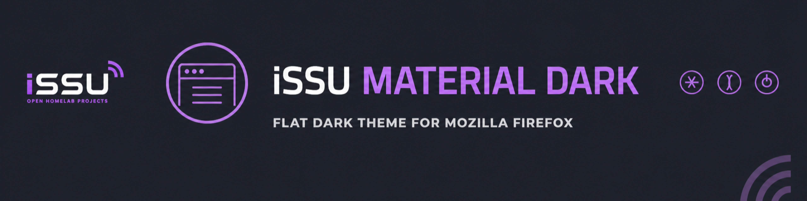
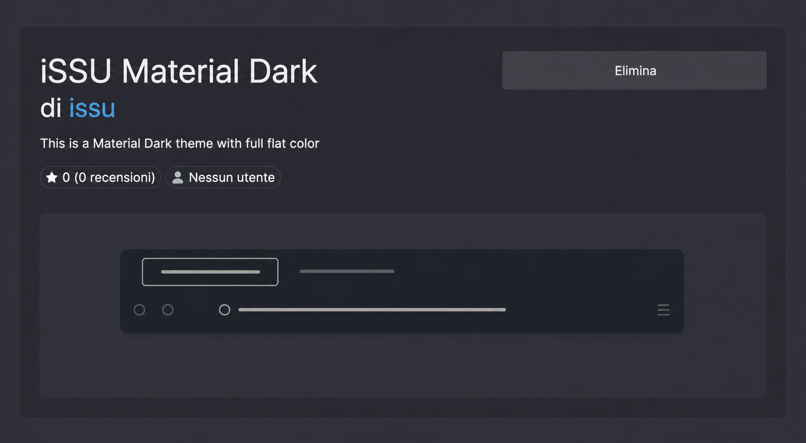

  

# iSSU Material Dark

A flat dark theme for Mozilla Firefox, designed around graphite surfaces, soft contrast and a distraction-free interface.

| Project information | |
|---|---|
| **Status** | 🟢 Stable |
| **Difficulty** | 🟢 Beginner |
| **Current version** | 3.0 |
| **Distribution** | Firefox Add-ons |
| **Documentation** | Complete |

## What is it?

iSSU Material Dark is a lightweight Firefox theme created for my own daily browser environment and later shared publicly.

It uses a consistent dark palette across the tab bar, toolbar, menus, sidebar and new-tab page. The design favours flat colours and restrained contrast instead of gradients or decorative effects.

## Preview

  

## Features

- Flat Material Dark colour palette
- Consistent graphite interface
- Soft text and icon contrast
- Dark tabs, toolbar, menus and sidebar
- Lightweight static theme
- Available directly from Firefox Add-ons

## Installation

The recommended installation method is the official Firefox Add-ons page:

### [Install iSSU Material Dark](https://addons.mozilla.org/it/firefox/addon/issu-material-dark/)

1. Open the link in Firefox.
2. Select **Install Theme** or **Add to Firefox**.
3. Confirm the installation.

Firefox applies the theme immediately. It can later be enabled, disabled or removed from **Add-ons and themes → Themes**.

## Theme source

The theme definition is available in:

`theme/issu_theme.json`

The file contains the colour configuration used by Firefox. It is included for documentation and manual testing; normal users should install the published version from Firefox Add-ons.

## Manual testing

For development or testing:

1. Open `about:debugging#/runtime/this-firefox`.
2. Select **Load Temporary Add-on**.
3. Choose `theme/issu_theme.json`.

A temporary theme is removed when Firefox restarts.

## Compatibility

The theme uses the Firefox WebExtension theme format and is intended for current desktop versions of Mozilla Firefox.

Appearance can vary slightly between operating systems and Firefox releases.

## Project philosophy

This theme was built for my own browser setup first. It remains intentionally small, focused and easy to maintain.

## License

The published theme is available under the **Creative Commons Attribution-NonCommercial-ShareAlike 3.0** license.

---

  

  Part of the <a href="https://github.com/issu-lab/Open-Homelab"><strong>iSSU Open Homelab</strong></a> ecosystem.

